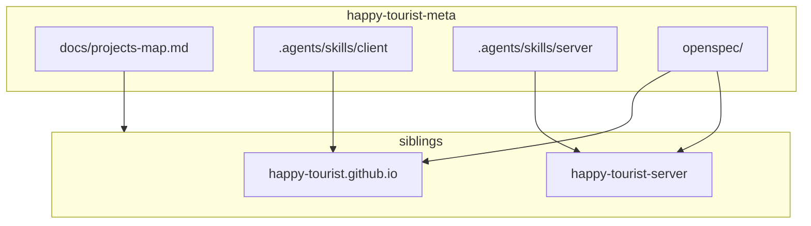

# Карта проектов: сервис → sibling-репозиторий

Канон соответствия сервисов экосистемы Happy Tourist (онлайн-шашки) путям в workspace разработчика. Исходный код **не** хранится в `happy-tourist-meta` — клонируется рядом (siblings `happy-tourist.github.io` и `happy-tourist-server`). Локальные отклонения путей — в [`projects-map.local.yaml`](../projects-map.local.yaml) (см. ниже).

См. также: [README.md](README.md) (оглавление docs), пакетные [`../happy-tourist.github.io/AGENTS.md`](../happy-tourist.github.io/AGENTS.md) и [`../happy-tourist-server/AGENTS.md`](../happy-tourist-server/AGENTS.md).

## Layout workspace

```
<workspace>/                          # напр. ht (не git)
├── happy-tourist-meta/               # этот репозиторий: docs, OpenSpec, AI skills
├── happy-tourist.github.io/          # client SPA (Vue 3 + Quasar, GitHub Pages)
└── happy-tourist-server/             # Colyseus multiplayer backend
```

Пути в таблицах ниже — **относительно корня `happy-tourist-meta`**, по умолчанию `../happy-tourist.github.io/...` и `../happy-tourist-server/...`.

## Client и server

| Сервис | Роль | Git-репозиторий | Путь исходников | Документация / контекст |
|--------|------|-----------------|-----------------|-------------------------|
| **Client** | Vue 3 + Quasar SPA (шашки) | `happy-tourist.github.io` | `../happy-tourist.github.io/` | runtime: `../happy-tourist.github.io/AGENTS.md`; skills: `.agents/skills/client/` в meta |
| **Server** | Colyseus rooms + auth + HTTP | `happy-tourist-server` | `../happy-tourist-server/` | runtime: `../happy-tourist-server/AGENTS.md`; skills: `.agents/skills/server/` в meta |

Runtime-код и пакетные `AGENTS.md` живут **в sibling-репозиториях**. Client/server skills и OpenSpec — в **happy-tourist-meta** (`.agents/skills/client/`, `.agents/skills/server/`, `openspec/`).

## Локальный `projects-map.local.yaml`

У каждого разработчика свой файл в корне `happy-tourist-meta` (в git **не** коммитится). Шаблон: [`projects-map.local.yaml.example`](../projects-map.local.yaml.example).

Ключи совпадают с таблицей «Пути для OpenSpec / агентов». Значения — относительные (от корня `happy-tourist-meta`) или абсолютные пути.

```yaml
client: ../happy-tourist.github.io
server: C:/Users/You/work/happy-tourist-server
```

**Resolution из корня `happy-tourist-meta`**

1. Прочитать канон (этот файл).
2. Если существует `projects-map.local.yaml` — смержить: local **перекрывает** канон по ключу.
3. Относительные пути резолвить от корня `happy-tourist-meta`; проверить, что корень существует (например `{client}/package.json` или `{server}/package.json`).
4. Если путь не найден — **спросить у пользователя**, не угадывать.

## Child `project-map.md`

В корне sibling-репозиториев — `project-map.md` с ключом **`happy-tourist-meta`** (относительный путь к этому метарепозиторию).

| Расположение клона | Значение `happy-tourist-meta` (default sibling layout) |
|--------------------|--------------------------------------------------------|
| `<workspace>/happy-tourist.github.io/` рядом с `happy-tourist-meta` | `..` |
| `<workspace>/happy-tourist-server/` рядом с `happy-tourist-meta` | `..` |

Пример (в корне client или server):

```markdown
| Key | Relative path |
|-----|---------------|
| happy-tourist-meta | .. |
```

**Resolution из sibling-репо**

1. Прочитать локальный `project-map.md`, ключ `happy-tourist-meta`.
2. Корень валиден, если существует `{happy-tourist-meta}/docs/projects-map.md`.
3. Далее — канон + опциональный `{happy-tourist-meta}/projects-map.local.yaml`.
4. Если не найдено — спросить абсолютный путь к `happy-tourist-meta`.
5. Ссылки в child markdown на канон: `happy-tourist-meta/docs/...` (не `../../docs/...`).

## Пути для OpenSpec / агентов

Канон путей к исходникам **от корня `happy-tourist-meta`**. Перед доступом читать эту таблицу (+ local YAML). OpenSpec: [openspec/config.yaml](../openspec/config.yaml) (`projectsMap` → этот файл).

| Ключ | Путь (от корня happy-tourist-meta) | Назначение |
|------|-------------------------------------|------------|
| `client` | `../happy-tourist.github.io/` | Vue 3 + Quasar SPA (`happy-tourist-client`) |
| `client.agents` | `../happy-tourist.github.io/AGENTS.md` | продукт / стек / домены client |
| `client.src` | `../happy-tourist.github.io/src/` | исходники UI |
| `client.pages` | `../happy-tourist.github.io/src/pages/` | route pages (Login/Lobby/Game) |
| `client.stores` | `../happy-tourist.github.io/src/stores/` | Pinia (`auth`, `theme`, `game`) |
| `client.boot` | `../happy-tourist.github.io/src/boot/` | Quasar boot (`theme`, `colyseus`, `i18n`) |
| `server` | `../happy-tourist-server/` | Colyseus backend |
| `server.agents` | `../happy-tourist-server/AGENTS.md` | продукт / стек / домены server |
| `server.src` | `../happy-tourist-server/src/` | исходники сервера |
| `server.config` | `../happy-tourist-server/src/config/` | OAuth providers (`auth.ts` / `addProvider`) |
| `server.rooms` | `../happy-tourist-server/src/rooms/` | Room handlers |
| `server.schema` | `../happy-tourist-server/src/rooms/schema/` | `@colyseus/schema` state |
| `server.db` | `../happy-tourist-server/src/db/` | GameDatabase / users schema |
| `server.tests` | `../happy-tourist-server/test/` | mocha + `@colyseus/testing` |
| `server.loadtest` | `../happy-tourist-server/loadtest/` | `@colyseus/loadtest` scripts |

Команды из каталогов пакетов (ключ `client` / `server`):

- Client: `npm install`, `npm run dev`, `npm run lint`, `npm run typecheck`, `npm run build`
- Server: `npm install`, `npm run dev`, `npm test`, `npm run build`, `npm run loadtest`

Команды `npm` запускает **агент** из каталога sibling-репо (client или server). Не ждать подтверждения пользователя; при падении — починить до завершения задачи.

## Skills discovery

- OpenSpec (meta): `.agents/skills/` (`openspec-*`, [`commit`](../.agents/skills/commit/SKILL.md))
- Client-wide (meta): [`.agents/skills/client/`](../.agents/skills/client/) — runtime UI в `../happy-tourist.github.io/`
- Server-wide (meta): [`.agents/skills/server/`](../.agents/skills/server/) — runtime Colyseus в `../happy-tourist-server/`
- Индекс: [`.agents/AGENTS.md`](../.agents/AGENTS.md)

## Связь docs ↔ siblings


